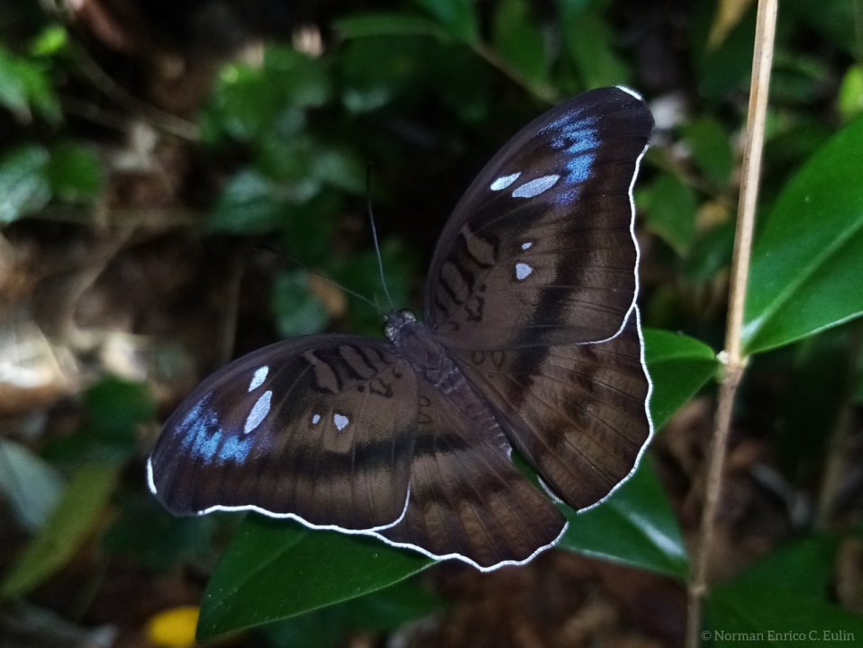

  # ChrysaLink — Lepidoptera Host Plant Explorer

  

  An interactive web explorer for Lepidoptera (butterflies and moths) and their host plants. ChrysaLink visualizes relationships between lepidoptera species and plants using curated datasets, interactive maps, and species pages — useful for researchers, educators, and nature enthusiasts.

  Live site: https://chrysalink.vercel.app/

  **Quick Overview**
  - **Purpose:** Explore host-plant relationships for Lepidoptera species with searchable pages and interactive visualizations.
  - **Audience:** Biologists, ecologists, citizen scientists, educators, and hobbyists.
  - **Status:** Website (informational and exploratory) — not a library or installable package.

  **Hero / Screenshots**

  

  **What you’ll find here**
  - Curated species and plant datasets used to power the explorer.
  - Interactive map and relationship network visualizations.
  - Searchable species pages with host plant lists and observations.

  Technology
  - Frontend: Vite + React/TypeScript (see `frontend/`)
  - Backend: Node / Supabase functions & SQL data (see `backend/`)
  - Data: CSV exports and curated datasets stored under `backend/data/`

  How to preview locally
  - This repository contains a website — to run a local development preview (if you want to work on the code):

  ```pwsh
  cd frontend
  npm install
  npm run dev
  ```

  Open the UI at the local dev URL printed by Vite (usually `http://localhost:5173`). Note: this repo is primarily informational; the live site is the main entrypoint.

  Assets used in this README
  - Logo: `frontend/public/navbar/logo.svg` and `frontend/public/navbar/logo.png`
  - Footer logo: `frontend/public/footer/footer_logo.svg`
  - Landing images: `frontend/public/landingpage_images/*`

  Contributing
  - Found an issue or want to improve the UI or data? Open an issue or a pull request with a clear description and reproduction steps.
  - Data contributions: add CSVs or suggested improvements to the `backend/data/` directory and include sources/credits.

  Credits & Data Sources
  - See `backend/docs/supabase_db.sql` and `backend/data/` for data layout and attribution.

  License
  - Check the repository root for license information. If none is present, please contact the maintainers before reusing data or assets.

  Contact
  - Project homepage: https://chrysalink.vercel.app/
  - For questions or collaboration, open an issue in this repository.

  ---
  _This README is focused on presenting the website and how to preview or contribute._
  
